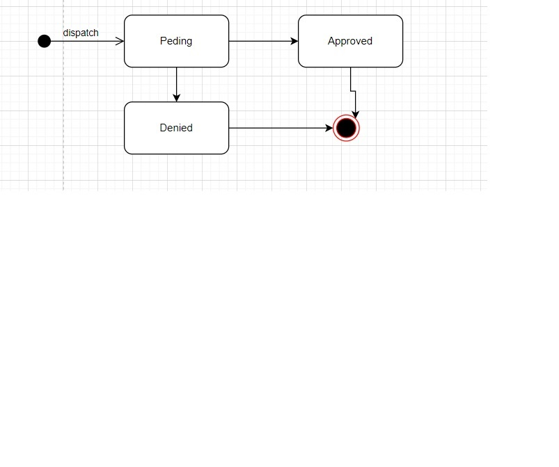
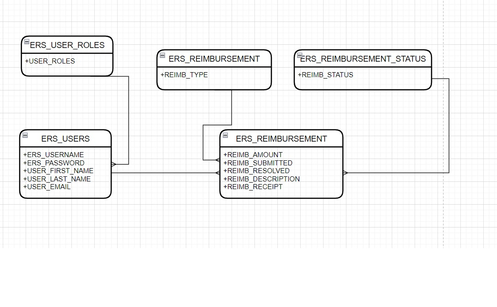
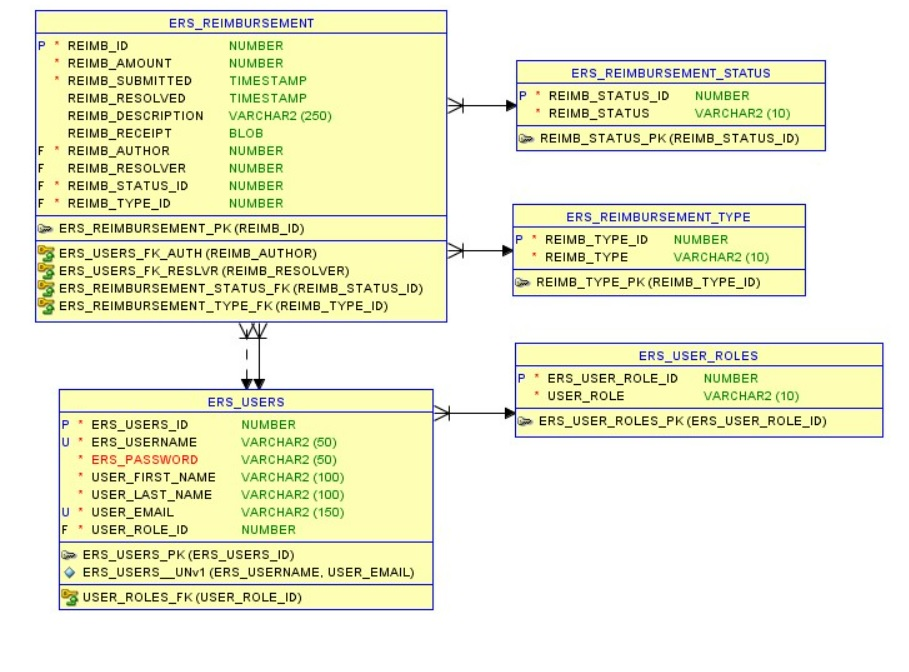
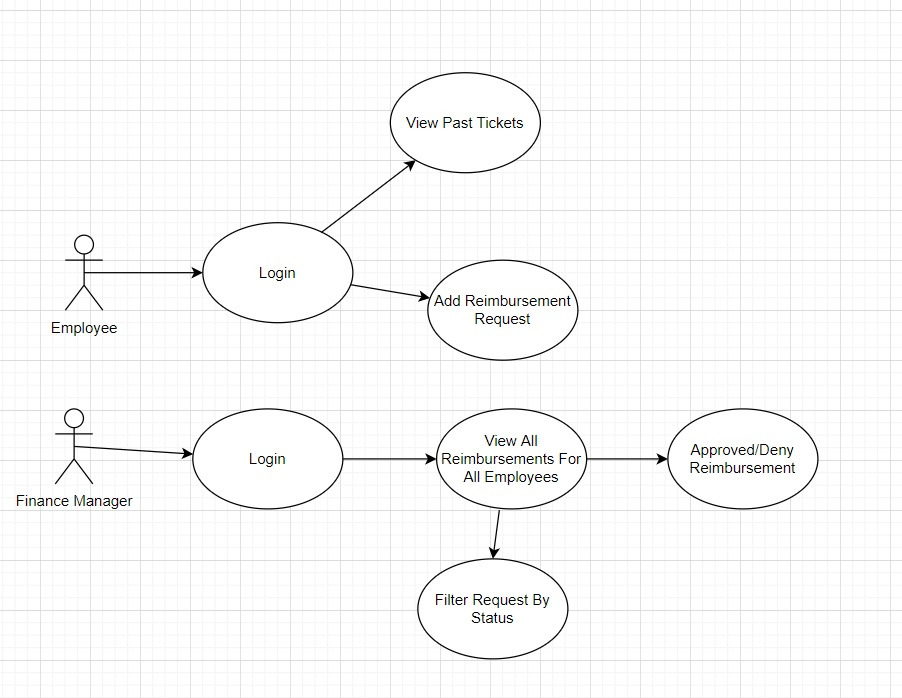
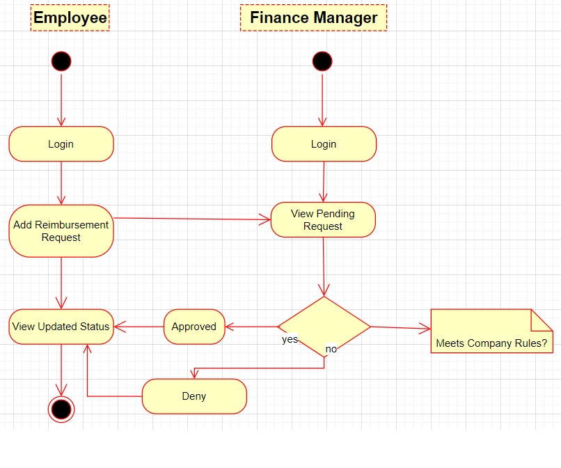
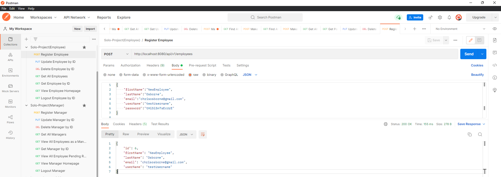
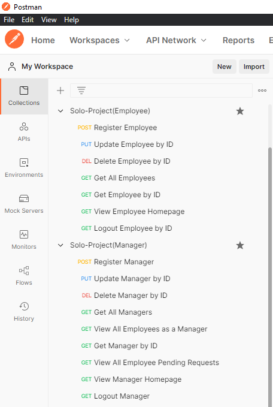

# Project 1: Employee Reimbursment System (ERS) using The Hibernate ORM
In this project I built a CRUD web application that functions as an Expense Reimbursement System (ERS). It manages the process of reimbursing employees for expenses incurred while on company time. 
* Some of the features that it entails are:
  * All employees in the company can login and submit requests for reimbursement and view their past tickets and pending requests. 
  * Financ managers can log in and view all reimbursement requests and past history for all employees in the company. 
  * Finance managers are authorized to approve and deny requests for expense reimbursement.

## Tech Stack
Through this project I developed and used a variety of skills, including the ones listed below.
- Java 8
- JUnit
- Mockito
- Apache Maven
- Jackson library (for JSON marshalling/unmarshalling)
- Java EE Servlet API (v4.0+)
- PostGreSQL deployed on AWS RDS
- Postman
- AWS CodeBuild
- AWS CodePipeline
- Git SCM (on GitHub)

## Employee User Stories 
- An Employee can login
- An Employee can view the Employee Homepage
- An Employee can logout
- An Employee can submit a reimbursement request
- An Employee can view their pending reimbursement requests
- An Employee can view their resolved reimbursement requests
- An Employee can view their information
- An Employee can update their information

## Manager User Stories
- A Manager can login
- A Manager can view the Manager Homepage
- A Manager can logout
- A Manager can approve/deny pending reimbursement requests
- A Manager can view all pending requests from all employees
- A Manager can view all resolved requests from all employees and see which manager resolved it
- A Manager can view all Employees
- A Manager can view reimbursement requests from a single Employee 

## Flowcharts
**State-chart Diagram (Reimbursement Statuses)** 
 
    
 

**Logical Model**
 
    
 

**Physical Model**
 
    
 

**Use Case Diagram**
 
    
 

**Activity Diagram**
 
    
 

## Technical Features
- The back-end system uses the Hibernate ORM to connect to an **AWS RDS Postgres database**. 
- JDBC logic is abstracted away by the custom ORM 
- Programmatic persistence of entities (basic CRUD support) using custom ORM
- File-based and programmatic configuration of entities
- Generated Jacoco reports that display coverage metrics
- Usage of the java.util.Stream API throughout
- The application uses Postman to test endpoints that call the server-side components(See Example Images on Postman Queries Below). 
- The application uses a layered architecture and follows the DAO design process.
- The application uses log4j for detailed logging throughout the application. 

## Example Postman Queries
**Register Employee**
 
    
 

**Update Employee by ID**
 
    
 

**Delete Employee by ID**
 
    
 

**Some Other Postman Queries**
 
    
 
